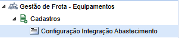
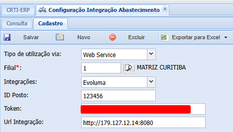
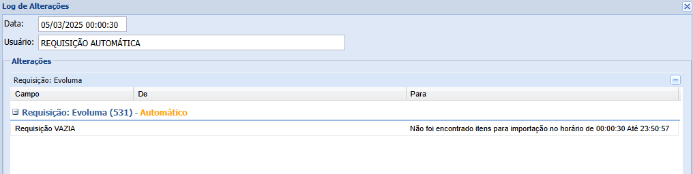

# Integração de Abastecimentos

A integração de abastecimentos é um recurso do CRTI ERP que facilita a comunicação entre o sistema e outras ferramentas, como softwares de gestão de combustíveis, bombas de abastecimento, entre outros. Este recurso garante a atualização contínua dos dados dos postos de combustível, proporcionando informações precisas e atualizadas para a tomada de decisões.

---

## Visão Negocial

O principal objetivo do sistema de abastecimento é a integração automática dos dados provenientes dos postos de combustível, incluindo movimentações de materiais como Diesel S10/S500, aditivos e óleos. Com isso, a gestão do estoque e das operações se torna mais eficiente, otimizando o fluxo de informações e facilitando a análise dos dados.

---

## Requisição Automática

A integração automática é realizada a cada 10 minutos, em intervalos fixos (por exemplo, 8:10, 8:20, etc.), ao longo das 24 horas (das 00:00:00 às 23:59:59). Durante esse processo, o sistema consulta e integra os dados de abastecimento disponíveis no posto de combustível diretamente no CRTI ERP.

> **Nota:**  
> Também é possível executar a integração manualmente de forma retroativa, utilizando o botão de "reimportar". Isso é útil, por exemplo, quando um novo posto é cadastrado e há necessidade de importar dados históricos correspondentes ao período desejado.

> **Beta:**  
> Existe uma versão *beta* que processa os lotes em fila, ao invés de processá-los todos de uma vez, visando melhorar a performance e a escalabilidade do sistema.

---

## Requisitos

Para a correta configuração e funcionamento da integração, é necessário:

- **Configuração da Filial:**  
  Definir a filial onde será realizado o cadastro. Cada filial pode ter apenas uma configuração vinculada.

- **Dados de Integração:**
    - URL de integração
    - Número do posto
    - Token de acesso (quando a API exigir)
    - Login e senha (quando a API exigir)

---

## APIs Disponíveis

O sistema integra com diversas APIs e também oferece integrações via Excel:

1. **CTA:** Integração com a API da CTA.
2. **GTFrota:** Integração com a API da GTFrota.
3. **Evoluma:** Integração com a API da Evoluma.
4. **Polisoftware:** Integração com a API da Polisoftware.
5. **Ticket Log:** Integração via Excel (manual).
6. **Ionics:** Integração via Excel (manual).

> **Observação:**  
> As integrações via Excel (Ticket Log e Ionics) são executadas somente de forma manual.

---

## Fluxo de Requisição

1. **Requisição:**  
   A solicitação é enviada e, se for bem-sucedida, os dados retornados passam para a próxima etapa.

2. **Tratamento de Dados:**  
   São processadas informações como quantidade abastecida, placa, horímetro, odômetro, entre outras.

3. **Processamento:**  
   Os dados são integrados à filial correspondente ao lote mestre de abastecimentos, que deve coincidir com a configuração previamente definida.

---

## Fluxos de Processamento

Após o tratamento dos dados, o processamento pode seguir dois caminhos:

1. **Saída de Estoque:**  
   Verifica a quantidade disponível e gera a saída de estoque correspondente.

2. **Entrada de Estoque:**  
   Gera a entrada de estoque, garantindo a atualização dos registros.
   > **Nota:** Este fluxo é gerenciado pelo mesmo processo de BEM-I e BSM-I, não sendo tratado diretamente pelo módulo de abastecimento.

---

## Usabilidade e Configuração

### 1. Acessando a Tela de Configuração

- **Navegação:**  
  Acesse o menu:  
  `Gestão de Frota  Equipamentos` > `Cadastros` > `Configuração de Integração de Abastecimento`  
  

### 2. Cadastro e Configuração

- **Aba Cadastro:**  
  Clique na aba **Cadastro**.

- **Tipo de Utilização:**  
  Selecione o método de integração desejado:
    - **Web Service (API)**
    - **Excel**

- **Filial:**  
  Selecione a filial que será utilizada para a integração. (Cada filial só pode ter uma configuração.)

- **Integrações Disponíveis:**  
  Escolha a integração desejada entre as opções disponíveis.

- **Campos Dinâmicos:**  
  Dependendo do tipo de integração selecionado, os campos exibidos se tornam dinâmicos e obrigatórios:
    - **URL de Integração:**  
      Varia de acordo com a integração escolhida. Exemplos:
        - CTA: `https://www.ctasmart.com.br:8443`
        - Evoluma: `http://179.127.12.14:8080`
        - GTFrota: `http://200.150.115.61`
        - Polisoftware: `https://4zzfd4roya9y.share.zrok.io`

      > **Nota:**  
      > Há validações para campos obrigatórios e formatação. Por exemplo, o campo de URL deve conter uma URL válida.

- **Campos Sensíveis:**  
  Informações como Login, Senha, Token e Id do Posto podem variar de cliente para cliente. Em alguns casos, até a URL poderá ser personalizada.

### 3. Salvando a Configuração

- Após preencher todos os campos obrigatórios, salve a configuração.  
  

### 4. Registro e Monitoramento

- **Execução Automática:**  
  Uma vez configurada, a integração será executada automaticamente a cada 10 minutos, conforme descrito na seção **Requisição Automática**.

- **Log de Requisições:**  
  Todas as requisições são registradas. Visualize os logs na aba **Log**.  
  

### 5. Reimportação de Dados

- Se necessário, utilize o botão **reimportar** para atualizar os dados manualmente.
  > **Nota:**  
  > A reimportação pode ser feita de forma manual e pode abranger períodos retroativos conforme a data do lote.

### 6. Tela de Integração

- **Acesso à Tela de Integração:**  
  Navegue até:  
  `Gestão de Suprimentos` > `Integrações` > `Integração - Abastecimento`  
  

> **Observação Importante:**
> - Os lotes são criados automaticamente na virada do dia, mesmo que não contenham abastecimentos.
> - Uma vez que o lote é liberado, não serão realizadas novas requisições para ele. Caso ocorram novos abastecimentos no mesmo dia, os itens do lote liberado poderão ser duplicados. Por esse motivo, recomenda-se realizar o fluxo de integração no dia seguinte.
> - Ao processar o lote, o sistema efetua os lançamentos de acordo com o fluxo de entrada/saída de estoque conforme o configurado.
> - É possível vincular serviços aos equipamentos, alterar o tipo de aplicação de um item e associar um contrato/subempreiteiro.
>
> **Informações Importantes para Integração:**
> - O equipamento só será vinculado se houver informações de Horímetro/Odometria e Placa.
> - A pesquisa de equipamento é realizada prioritariamente pela placa cadastrada na tela de equipamentos. Se não for encontrada, será realizada uma busca pelo apelido disponibilizado pela API, que deve ser idêntico ao cadastro do equipamento.
> - O vínculo de materiais é realizado de acordo com o nome do material ou o código de integração do material disponibilizado pela API. Os cadastros devem ser idênticos aos informados pela API.
> - Essas informações também são válidas para a integração via Excel. Exceto a da criação do lote que deve ser feita manualmente.
> - Após todas essas condições se não for possível localizar o equipamento o item será tratado como "Centro de Aplicação".

---

**Documentação referente à data de criação: 06/03/2025**

